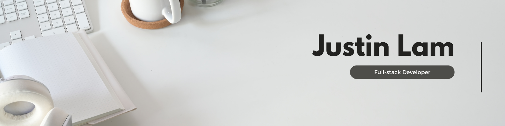

I'm a full-stack developer from Toronto. I recently graduated from Lighthouse Labs's web development program. Click on the badge to connect with me on LinkedIn!

You can find my work and Portfolio [Here](https://portfolio-justinklam.vercel.app/)!

### Stats

  
  

<!--
**justinklam/justinklam** is a ✨ _special_ ✨ repository because its `README.md` (this file) appears on your GitHub profile.

Here are some ideas to get you started:

- 🔭 I’m currently working on ...
- 🌱 I’m currently learning ...
- 👯 I’m looking to collaborate on ...
- 🤔 I’m looking for help with ...
- 💬 Ask me about ...
- 📫 How to reach me: ...
- 😄 Pronouns: ...
- ⚡ Fun fact: ...
-->
